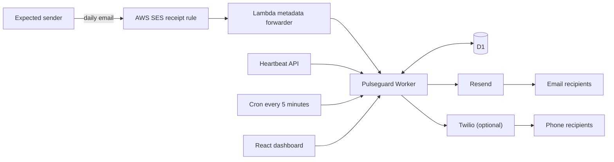

# Architecture

Pulseguard uses one Worker for the web app, API, scheduled checks, and inbound email events. D1 is the durable source of truth.

## Data flow

1. A message arrives at a unique inbox address. The email handler normalizes the destination and rejects unknown inboxes.
2. A successful match updates `last_received_at` and appends an immutable receipt record.
3. Every five minutes, the scheduled handler loads enabled monitors and evaluates their UTC deadline plus grace period.
4. For an overdue monitor, the Worker claims a deterministic `monitor_id:day` alert-run ID. D1's unique constraint prevents duplicate fan-out across overlapping cron invocations.
5. Email and SMS recipients are delivered independently. The result of every recipient attempt is stored on the alert run.

## Tables

- `monitors`: inbox, schedule, grace period, status, and last receipt
- `recipients`: any number of email or SMS destinations
- `receipts`: append-only evidence of inbound signals
- `alert_runs`: daily idempotency claim and delivery outcome

Indexes follow the actual access paths: enabled monitors, recipients by monitor, and recent receipts by monitor.

## Failure behavior

- Duplicate inbound messages are ignored when they share a message ID.
- Duplicate cron executions cannot create a second daily alert run.
- One failed recipient does not prevent delivery to the others.
- A provider failure is recorded as `partial_failure`; v1 surfaces that state for operator review.
- Provider calls use a stable email idempotency key where supported.

## Deliberate v1 constraints

Schedules use UTC and are daily. A mature multi-tenant release should use IANA timezones, holiday calendars, authenticated dashboard writes, verified recipients, and a queue-backed retry policy.
